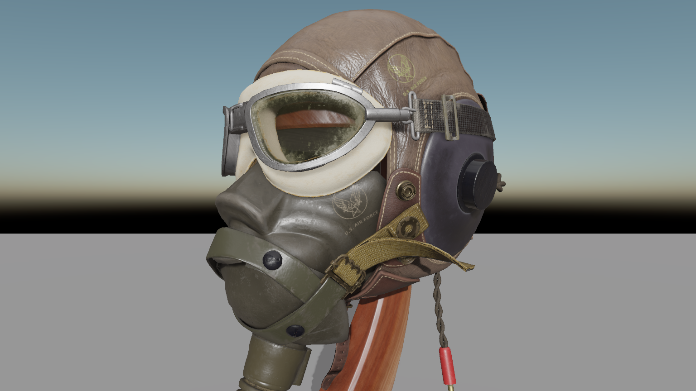
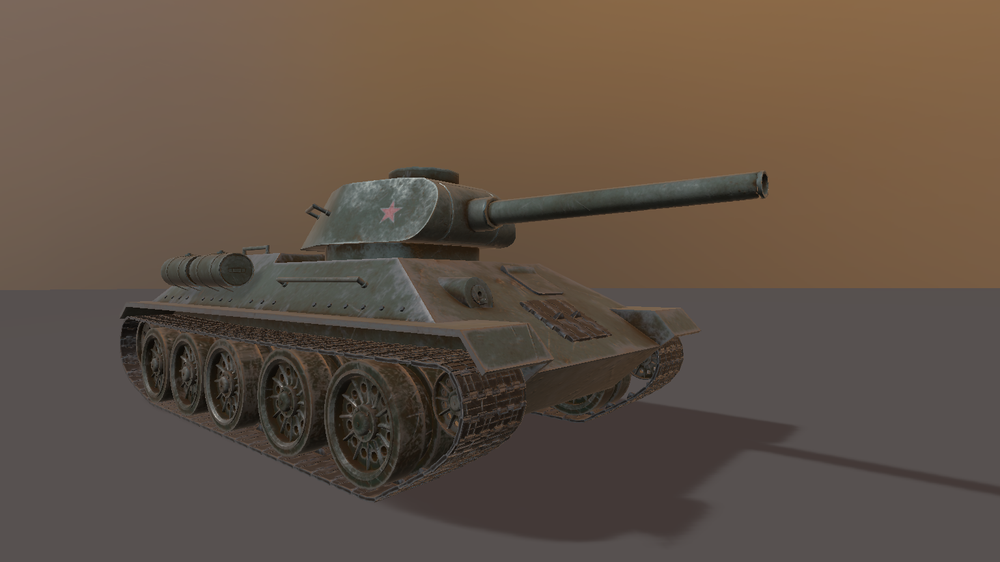
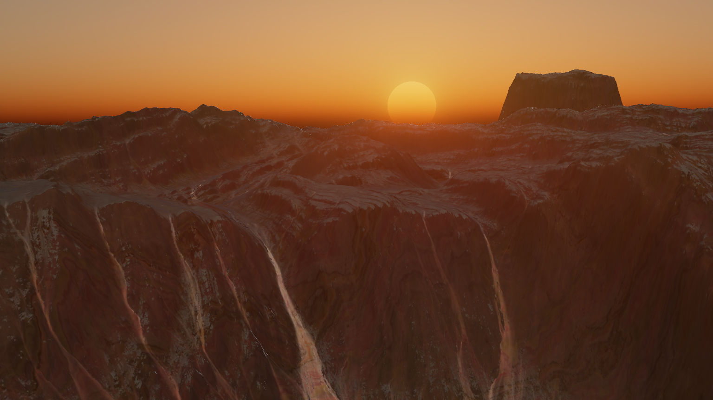
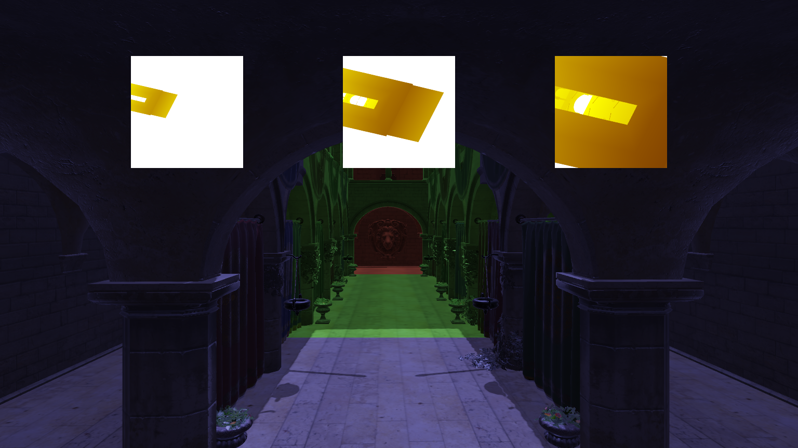

# Crow-Engine

## Features

- WebGL based Rendering System
  - PBR
  - Cascaded shadow maps (VSM)
  - Dual depth peeling
  - Atmospheric scattering
  - Godrays
  - Bloom
  - Gamma correction, tone mapping
- Scene System
- Logging System
- Input handling
- Own GLTF 2 parser
- Time System
- Audio
- Splines

### PBR rendering

### Atmospheric scattering

### Casceded shadow mapping

